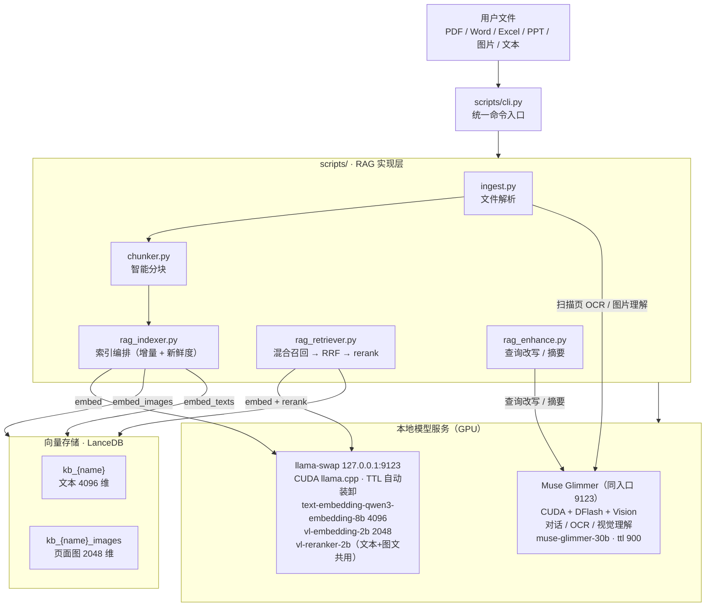

# local-model

本地多模态 RAG 系统。`scripts/cli.py` 是统一命令入口，`scripts/` 承担解析、索引、检索与模型调用；模型通过本机 llama-swap 按需运行。

## 架构图

> **路径约定**：下文命令中的 `<SKILL_ROOT>` 指本 skill 目录（公开仓库里就是 `<仓库根>/skill`），
> `<MODELS_DIR>` 指你存放 GGUF 的目录，`<LLAMA_CPP_DIR>` 指 llama.cpp 二进制目录。
> 私有知识库路径建议写进 `registry.local.yaml`（不进 git），不要改本仓库跟踪的文件。



**职责边界：** `scripts/cli.py` 只负责参数解析和命令分发，业务逻辑在其余 `scripts/` 模块；模型服务与生命周期由外部 llama-swap 配置管理。已退役的 local-models MCP 不再是入口。详见 [`AGENTS.md`](AGENTS.md)。


## 模型选型

| 用途 | 模型 | 维度 | 后端 | GPU |
|---|---|---|---|---|
| **文字向量** | text-embedding-qwen3-embedding-8b (Q4_K_M) | 4096 | llama-swap 9123 | CUDA, --gpu-layers 99 |
| **图向量** | vl-embedding-2b | 2048 | llama-swap 9123 | CUDA, --gpu-layers 99 |
| **文本/图文精排** | vl-reranker-2b（共用） | - | llama-swap 9123 | CUDA, --gpu-layers 99 |
| **视觉理解** | Muse-Glimmer-30B-Q4_K_M + mmproj | - | llama-swap 9123 | CUDA, --gpu-layers 99 |
| **对话/改写** | Muse-Glimmer-30B-Q4_K_M + DFlash | - | llama-swap 9123 | CUDA + DFlash, --gpu-layers 99 |

**选型理由：**
- 检索模型（embedding/rerank）走 llama-swap：CUDA 版 llama.cpp（2026-09-21 由 Vulkan 切换），TTL 自动装卸，4个模型共享一套基础设施
- 视觉/对话走同一入口的 `muse-glimmer-30b`（2026-09-21 甲-1 由 8080 独立进程迁入）：CUDA 13.3 + DFlash 投机解码，**16K** 上下文（单槽 `--parallel 1`，与检索栈共存所需），125-220 tok/s，同时做 OCR、描述、分类、对话，不需要 PaddleOCR
- 所有模型全层 GPU（`--gpu-layers 99`），不走 CPU

## 数据库 / 向量库

**LanceDB**（列式存储，无锁并发，ANN 索引）

路径：`~/.local-rag/lancedb/`

### 表结构

每个知识库两个表，按维度分离：

| 表名 | 维度 | 用途 | Schema |
|---|---|---|---|
| `kb_{name}` | 4096 | 文本 chunks | vector, chunk_id, text, path, doc_type, heading_path, section_title, start_line, end_line, mtime_ns, model, metadata |
| `kb_{name}_images` | 2048 | PDF页面/图片 | vector, image_id, path, page_num, description, doc_type, mtime_ns, model, metadata |

### 索引类型

| 索引 | 用途 | 创建方式 |
|---|---|---|
| **IVF_HNSW_SQ** (ANN) | 语义向量检索 | `vector_store._ensure_index()`，建表时自动创建 |
| **INVERTED FTS** (BM25) | 关键词全文检索 | `_ensure_fts_index()`，首次 keyword_search 时懒加载创建 |

**BM25 FTS 配置：**
- `base_tokenizer="ngram"`，`ngram_min_length=2`，`ngram_max_length=4`
- 中文短语友好（按 2-4 字切分，不需要 jieba）
- 英文缩写（GPU/PDF）也能命中
- 失败自动降级到 Pandas LIKE 包含匹配

### 为什么用 LanceDB 而不是 SQLite

| 维度 | SQLite (旧) | LanceDB (新) |
|---|---|---|
| 检索方式 | 全表扫描 + 余弦距离 | ANN (IVF_PQ) |
| 并发 | 单写锁 | 无锁并发 |
| 存储 | 行式 | 列式（压缩率高） |
| 大规模 | 慢（O(n)） | 快（O(log n)） |

### 数据库管理办法

**数据目录结构：**
```
~/.local-rag/
├── lancedb/                    # LanceDB 数据库（向量+全文索引）
│   ├── kb_{name}.lance/        # 文本向量表（4096维）
│   └── kb_{name}_images.lance/ # 图片向量表（2048维）
├── pdf-cache/                  # PDF 渲染缓存（WebP）
│   └── <pdf_sha256>/           # 按 PDF 内容哈希分目录
│       ├── page_001.webp
│       ├── page_002.webp
│       └── meta.json           # 渲染参数（DPI/quality/max_edge）
└── tmp/                        # 临时文件（构建/迁移中间产物）
```

**备份策略：**
- 索引是**可再生投影**，真相源是原始文件；不需要定期备份索引
- 需要备份时：复制整个 `~/.local-rag/lancedb/` 目录（LanceDB 是文件级数据库，复制即备份）
- 知识库配置（registry.yaml）在项目目录中，随 git 版本管理

**清理策略：**
- `cli.py --kb <name> index`：默认删除已不存在文件的 chunks；仅明确需要保留时使用 `--no-prune`
- PDF 缓存按 sha256 分目录，PDF 文件删除后缓存不会自动清理；手动删除 `~/.local-rag/pdf-cache/<sha256>/`
- 临时文件 `~/.local-rag/tmp/` 可随时删除（不影响索引）

**迁移流程：**
- 索引重建：`cli.py --kb <name> index --force`（`migrate` 子命令不存在，2026-09-21 核实）
- 维度变更：需要全量重建 `cli.py --kb <name> index --force`（向量维度不可原地修改）
- 模型变更：embed_model 改变时必须 `--force` 重建，否则向量空间不兼容

**损坏恢复：**
- LanceDB 表损坏：删除对应 `.lance/` 目录后 `--force` 重建
- FTS 索引损坏：`cli.py --kb <name> index --force`（全量重建），或删除表后重建（`optimize` 子命令不存在）
- 并发写入冲突：索引操作有 PID 文件锁；先核对所属进程，只清理确认属于本任务的残留锁或进程

**版本管理：**
- LanceDB 版本升级后可能需要全量重建（`index --force`）
- registry.yaml 中的 `dimensions` 和 `embed_model` 是索引版本的关键标识，变更即需重建

### RAG 库文件夹结构（知识库组织规范）

**知识库根目录规范：**
```
<kb_root>/
├── 00-入口/                    # 索引/导航/README
├── 01-文档/                    # 正式文档（PDF/DOCX/MD）
├── 02-参考/                    # 参考资料（规范/标准/论文）
├── 03-数据/                    # 数据文件（XLSX/CSV/JSON）
├── 04-演示/                    # 演示文稿（PPTX）
├── 05-图片/                    # 图片素材（PNG/JPG/WebP）
└── 99-归档/                    # 旧版本/废弃文件（仍可检索但标记 archived）
```

**命名规范：**
- 目录：`序号-中文名称`（如 `01-文档`），序号控制排序
- 文件：`<项目编号>_<主题>_<版本>.<ext>`（如 `ARCH-001_立面设计_v2.pdf`）
- 避免空格和特殊字符，用 `-` 或 `_` 分隔
- 版本号用 `v1/v2/final`，不用 `最终版/最终版2/真的最终版`

**多库隔离：**
- 每个知识库独立 LanceDB 表（`kb_{name}`），互不干扰
- `--kb all` 跨库检索时分别查询再合并排序
- 知识库配置在 `registry.yaml` 中定义，新增库 = 加一段配置，不改代码

**文件类型覆盖：**
| 类型 | 扩展名 | 解析方式 |
|------|--------|----------|
| 文本 | .md .txt .py .json .yaml | 直接读取 |
| PDF | .pdf | PyMuPDF 文本层 + WebP 渲染 + VLM OCR（扫描件） |
| Word | .docx | python-docx |
| Excel | .xlsx .csv | pandas + openpyxl |
| PPT | .pptx | python-pptx |
| 图片 | .png .jpg .webp | VLM 描述 + 图向量 |

## 召回策略

### 文本检索（默认 hybrid + RRF 融合）

```
查询(query)
    │
    ├──▶ 上下文消歧（可选 --context）: 用上一轮对话消歧代词/省略
    │
    │
    ├──▶ Qwen 查询指令（默认启用）: 查询侧加前缀 "Instruct: ...\nQuery: "
    │     └── 文档侧不变，不重建向量；可回退 retrieve(use_query_instruction=False)
    │
    ├──▶ 语义召回: query(+指令) → embedding(4096维) → LanceDB ANN(IVF_HNSW_SQ) → top N
    │
    ├──▶ 关键词召回: query → LanceDB FTS(BM25, 中文 ngram 2-4) → top N
    │     └── path_filter 用 where(contains(path,'...'), prefilter=True) 服务端预过滤
    │
    ▼
RRF 融合（Reciprocal Rank Fusion）: 语义/关键词分别排名，融合分 = sw*1/(60+rank_sem) + kw*1/(60+rank_kw)
    │
    ▼
稳定去重（chunk_id 优先，缺失用 path+完整内容 sha256 前16位）
    │
    ▼
rerank 精排: vl-reranker-2b (cross-encoder) → recall_size=24 篇
    │
    ▼
MMR 多样性重排（可选）: 避免返回结果高度相似
    │
    ▼
agent 友好格式: [序号] 标题路径 (score=0.85, rerank) + source + 完整片段
```

**可选模式：**
- `semantic` — 仅语义检索
- `keyword` — 仅关键词（BM25 FTS，不调用模型，最快）
- `hybrid` — 混合检索 + RRF 融合（默认）

**高级选项：**
- `--explain` — 显示每条结果的四路分数（语义相似度 / 关键词匹配 / RRF 融合 / rerank 分数）
- `--context "上一轮对话"` — 多轮上下文消歧（零延迟规则引擎，代词→实体）
- `--mode parent-child` — Parent-Child 检索（chunk 检索后返回父文档上下文）
- `--trace out.html` — 生成检索推理链可视化
- `--no-rerank` — 跳过精排，只看纯召回排序
- `--route` — 查询路由（自动选 semantic/keyword/hybrid）
- `path_filter` — 路径包含过滤（服务端预过滤，不依赖取数上限）
- `doc_type_filter` — 文档类型过滤
- `use_query_instruction=False` — 禁用 Qwen 查询指令（回退到原始查询）

### 跨库检索（`--kb all`）

```
查询 → 遍历所有已索引知识库 → 分别检索 → 按 score 合并排序 → top_k
```

无索引或出错的库自动跳过，不影响其他库。

### 以图搜图（`search-image`）

```
查询图片 → embed_images() (vl-embedding-2b, 2048维) → LanceDB ANN → top_k
```

返回：图片路径、页码、webp 缓存路径、页面描述、相似度 score。

## PDF 入库策略

```
PDF 文件
    │
    ├──▶ PyMuPDF 提取每页文本层
    │
    ├──▶ 每页渲染为 WebP (144 DPI, quality=85, max_edge=2400)
    │     └── 增量缓存: ~/.local-rag/pdf-cache/<pdf_sha256>/page_XXX.webp
    │
    ├──▶ 文本 < 20字符的页面 → VLM (Muse Glimmer 30B Vision) 做 OCR + 描述
    │
    ├──▶ HTML 重组: 每页 =  + <div class="page-text">文本</div>
    │
    ├──▶ 智能分块（按标题/段落，非固定字符数）
    │
    ├──▶ 文字向量 (4096维) → kb_{name} 表
    │
    └──▶ 页面图向量 (2048维) → kb_{name}_images 表
```

**关键设计：**
- WebP 缓存按 PDF 的 sha256 分目录，文件未变更则跳过渲染
- 文本层优先，只有扫描件/图片页才调 VLM（节省 GPU 资源）
- 每页同时存文字向量和图向量，支持文本检索和以图搜图

## 可靠性设计

### 指数退避重试（适配 llama-swap TTL 冷加载）

llama-swap 模型 TTL 300s 自动卸载后，首次请求会报 `ConnectionReset (WinError 10054)`，模型冷加载需 ~12s。

`rag_client._request_json` 内置重试：
- **5次重试**，指数退避：2s → 4s → 8s → 16s → 30s（总等待约60s）
- 仅重试：连接错误 / 超时 / 5xx / 429 Too Many Requests
- 4xx 立即抛出（不重试无效请求）
- 重试日志输出到 stderr，便于排查

### 降级链维度校验

llama-swap 不可用时可能降级到其他 embedding 后端（如其他后端 768维 / API 1536维），但向量表是按 4096 维创建的。

**防护机制：**
- `embed_texts(include_dimensions=True)` 返回 `(vectors, dimensions)`，调用方可检测维度变化
- `vector_store.upsert_chunks` 写入前校验维度，不匹配则抛明确 `ValueError`：
  ```
  向量维度不匹配: 表 'kb_my_docs' 定义 4096 维, 实际输入 768 维。
  可能是降级链切换了模型（如 llama-swap 4096维 → 其他后端（如 768维））。
  请检查 registry.yaml 的 embed_model/dimensions 配置...
  ```
- 防止静默写入错误维度数据导致搜索结果异常

### 单图失败隔离

`embed_images()` 预处理阶段逐张隔离失败：
- 单张图片损坏/格式不支持 → 返回零向量（`[0.0]*2048`），不拖垮整个 batch
- 调用方可通过 `all(v == 0 for v in vector)` 检测并过滤失败项
- 批量请求阶段整个 batch 失败时保持零向量，不重试（避免无限循环）

## 故障排查

| 现象 | 原因 / 处理 |
|---|---|
| `ConnectionReset WinError 10054` | llama-swap 模型 TTL 卸载，冷加载约 12–16s。`rag_client` 内置 5 次指数退避重试，通常第 2–3 次成功。持续失败先 `curl 127.0.0.1:9123/running` |
| `ModuleNotFoundError: lancedb` | 依赖没装或用的是系统 Python。跑 `setup.ps1`，或用 `skill\.venv\Scripts\python.exe` |
| `向量维度不匹配: 表定义 4096 维, 实际输入 768 维` | 端点指向了别的 embedding 模型（降级链或改错端口）。核对 `registry.yaml` 的 `embed_model` / `dimensions` 与端点 |
| `unknown kb 'xxx'` / `E_INVALID_ARGS` | 库没注册或 `--kb` 写在了子命令之后。全局参数必须写在子命令**之前** |
| 关键词检索返回空 | 确认 LanceDB 表有 INVERTED FTS 索引，跑 `cli.py --kb <name> index --force` 重建 |
| 语义检索排序异常 | 确认代码是最新的（L2 距离越低越相似，排序方向修过一次） |
| 结果高度相似 | 用 `--mode semantic` 或调小 `--top-k`（`--mmr` 已不存在） |
| 短查询召回低 | 用 `--explain` 看是哪一路没召回（`--expand` 已不存在） |
| 代词查询（"它"/"这个"）效果差 | 加 `--context "上一轮对话"` 启用上下文消歧 |
| `另一个索引进程正在运行 (PID=…)` | 索引有 PID 文件锁；确认无进程后删 `~/.local-rag/index.lock` |

## 已知限制

- 图片入库慢：每张走一次 VLM（约 10–30s/张），大量图片建索引耗时长
- PDF 扫描页完全依赖 VLM，页数多的 PDF 索引慢
- 单文件默认上限 5MB、单库默认上限 10000 文件（`registry.yaml` 可改）；
  文件数超上限时孤儿清理会自动停用，避免误删未扫描到的文件
- 向量维度不可原地修改：换 `embed_model` 必须 `--force` 全量重建
- 图文检索需要外部图文库提供自己的 LanceDB 索引与 CLI，本仓库不代管

## 安装依赖

首次使用前必须安装依赖（lancedb / pyarrow / PyMuPDF 等）：

```powershell
# 在仓库根目录执行（setup.ps1 自己定位所在目录，不依赖 cwd）
powershell -ExecutionPolicy Bypass -File skill\setup.ps1
```

脚本会创建 `skill\.venv`、装好依赖，并自动跑一次 `doctor` 验证。之后所有命令都用 venv 里的 Python：

```powershell
# 方式1：激活 venv
skill\.venv\Scripts\Activate.ps1
python skill\scripts\cli.py doctor

# 方式2：直接调用 venv Python（无需激活）
skill\.venv\Scripts\python.exe skill\scripts\cli.py doctor
```

**可选：测试与 lint 依赖**（`setup.ps1` 不装，跑测试前必须补上）：

```powershell
skill\.venv\Scripts\python.exe -m pip install pytest ruff
skill\.venv\Scripts\python.exe -m pytest skill\tests -m "not integration"   # 不需要任何服务在跑
```

`cli.py doctor` 会最先检查依赖状态，缺失时明确提示哪些包没装。

## 快速开始

```powershell
# 0. 先注册一个知识库：编辑 skill\registry.yaml，把 my_docs 那段的注释取消、
#    root 改成你自己的目录（推荐写进 registry.local.yaml，见下节）

# 1. 诊断（依赖 / GPU / 模型端点 / 索引覆盖）
skill\.venv\Scripts\python.exe skill\scripts\cli.py doctor

# 2. 建索引（增量，自动跳过未变更文件）
skill\.venv\Scripts\python.exe skill\scripts\cli.py --kb my_docs index

# 3. 文本检索
skill\.venv\Scripts\python.exe skill\scripts\cli.py --kb my_docs retrieve "查询内容"

# 4. 跨库检索（自动搜索所有已索引库）
skill\.venv\Scripts\python.exe skill\scripts\cli.py --kb all retrieve "查询内容"

# 5. 以图搜图（需要 multimodal 类型的库）
skill\.venv\Scripts\python.exe skill\scripts\cli.py --kb my_docs search-image path\to\image.jpg

# 6. 检查索引新鲜度
skill\.venv\Scripts\python.exe skill\scripts\cli.py --kb my_docs freshness
```

> `--kb` 是**必填**的（不再有默认库）：不写会报 `E_INVALID_ARGS` 并提示可用库。

## 统一 CLI 命令清单

> **⚠️ 全局参数位置**：`--kb/--db/--registry` 必须写在**子命令之前**（与 `git`/`kubectl` 一致）。
> ✅ `cli.py --kb my_docs retrieve "query"`　❌ `cli.py retrieve "query" --kb my_docs`（后者报 unrecognized arguments，CLI 会给出提示）。
> 所有子命令均支持 `--json`（默认人类可读文本）。

| 命令 | 用途 |
|---|---|
| `index` | 增量建索引（支持 `--force` 全量重建、`--no-prune` 保留孤儿 chunks） |
| `freshness` | 检查索引新鲜度（非零退出码=过期） |
| `stats` | 查看索引统计（chunk数、文件数、文档类型分布） |
| `retrieve` | 混合检索 + rerank（真实 flag：`--kb all` 跨库、`--mode hybrid/semantic/keyword`、`--top-k`、`--no-rerank`、`--path-filter`、`--explain` 分数、`--trace out.html` 推理链） |
| `search-image` | 以图搜图（vl-embedding-2b 向量检索） |
| `ingest` | 解析单个文件（调试用，`--json` 输出结构化 Document） |
| `chunk` | 智能分块（调试用） |
| `rewrite` | 查询改写（LLM 扩展同义词+拆解复合查询） |
| `summary` | 文档摘要（标题+摘要+标签+实体） |
| `embed` | 直接调用 embedding（调试用） |
| `rerank` | 直接调用 rerank（调试用） |
| `doctor` | 完整诊断；会做真实 embedding 检查并可能初始化存储，不是只读探活 |

## 知识库注册表

`skill/registry.yaml` 提供公开示例；本机真实库写入同目录、未入 Git 的 `registry.local.yaml`，加载时按库名覆盖示例。新增公开示例可加一段配置：

```yaml
knowledge_bases:
  my_docs:
    type: text                    # text / multimodal
    root: ~/Documents/my-kb
    patterns: ["*.pdf", "*.docx", "*.xlsx", "*.pptx", "*.md"]
    dimensions: 4096
    embed_model: text-embedding-qwen3-embedding-8b
    capability:
      good_for: [文档全文检索]
      example_queries: [某份报告里的数据]
```

### 本机私有库：`registry.local.yaml`（不进 git）

仓库里的 `registry.yaml` 只放示例，你的真实路径放同目录的 `registry.local.yaml`：

```yaml
knowledge_bases:
  my_docs:
    type: text
    root: D:\我的资料\知识库
    patterns: ["*.md", "*.pdf"]
```

加载时它的 `knowledge_bases` 会**合并到 `registry.yaml` 之上**（同名条目以本地文件为准），
所以私有路径永远不进 git，公开仓库也不会因为同步而把你的目录带出去。

### 端点与端口覆盖

优先级：**函数参数 > 环境变量 > registry.yaml > 模块默认值**。

| 环境变量 | 作用 | 默认 |
|---|---|---|
| `LOCAL_RAG_BASE_URL` | embed / rerank 端点（llama-swap） | `http://127.0.0.1:9123` |
| `LOCAL_RAG_VLM_BASE_URL` | 图片 / PDF 扫描页的 VLM 端点 | `http://127.0.0.1:9123`（模型由 `model` 字段选） |
| `LOCAL_RAG_LLM_BASE` | 查询改写 / 摘要的 LLM 端点 | `http://127.0.0.1:9123`（同上） |

## 外部项目集成

外部项目可直接 import `skill/scripts/` 下的模块，复用 embedding/rerank 客户端和注册表，避免重复实现模型配置、重试逻辑、降级链。

> 注意：`scripts/` 是普通目录不是包名 `local_model_scripts`，**直接按模块名 import**（先把 scripts 目录加入 sys.path），不要写 `from local_model_scripts import ...`（会 ModuleNotFoundError）。

```python
import sys
from pathlib import Path

SKILL_ROOT = Path(r"<SKILL_ROOT>")      # 例：Path(r"C:\tools\local-models\skill")
sys.path.insert(0, str(SKILL_ROOT / "scripts"))

# rag_client 仅依赖标准库，始终可导入
from rag_client import (
    embed_texts,         # 文本嵌入（带指数退避重试）
    embed_images,        # 图片嵌入（单图隔离+批量请求）
    rerank_texts,        # 文本精排
    health_check,        # 健康检查
)
# rag_indexer 依赖 lancedb/pyarrow（本机已装）
from rag_indexer import load_registry, KBConfig

# 加载注册表（自动合并同目录 registry.local.yaml）
kbs = load_registry(SKILL_ROOT / "registry.yaml")
kb = kbs["my_docs"]
print(f"知识库: {kb.name}, 维度: {kb.dimensions}, 模型: {kb.embed_model}")

# 文本嵌入（返回维度，便于检测降级链变化）
vectors, dims = embed_texts(["hello world"], include_dimensions=True)

# 图片嵌入（支持文件路径 / data URL / raw base64）
img_vectors = embed_images([r"path/to/photo.png"])

# 重排
results = rerank_texts("query", ["doc1", "doc2"], top_k=5)
```

**设计要点：**
- `rag_client` 模块零第三方依赖（只用标准库），外部项目 import 不会因 lancedb 缺失而失败
- `rag_indexer` / `vector_store` 依赖 lancedb，缺失时优雅降级（`load_registry` 仍可用，返回原始 dict）
- 所有 HTTP 请求内置指数退避重试，外部项目无需自己实现

## GPU

所有模型默认跑在 GPU 上（RTX 5090 D 32GB）：

- **llama-swap 9123**：CUDA llama.cpp（2026-09-21 由 Vulkan 切换），`--gpu-layers 99 -b4096 -ub4096 -fa on`，3 个检索模型，TTL 按需装卸
  （模型清单与 TTL 的真相源是 `C:\AI\tools\llama-swap\config.yaml`；本文件是概览）
  （文本向量与共用 reranker `ttl: 0` 常驻；图文向量 `ttl: 300`）
- **Muse Glimmer（同入口 9123）**：CUDA 13.3 + DFlash 投机解码 + Vision，16K 上下文（单槽），
  125-220 tok/s，视觉理解 + 对话生成。由 llama-swap 托管，`ttl: 900` 空闲自卸
  （2026-09-21 甲-1 由 8080 独立进程迁入；旧计划任务 `MuseGlimmer` 已 Disabled）

### Muse Glimmer 30B + DFlash（对话/Agent 主模型）

**最优配置（已验证，RTX 5090 D 32GB）：**

```powershell
# 先把这两个变量换成你自己的路径
$LlamaDir = "<LLAMA_CPP_DIR>"       # llama.cpp 二进制目录，例：C:\tools\llama.cpp-cuda
$MuseDir  = "<MODELS_DIR>\Muse"     # 模型目录，例：C:\models\Muse

& "$LlamaDir\llama-server.exe" `
    --gpu-layers 99 `
    -m "$MuseDir\Muse-Glimmer-30B-KQuant-17GB-Q4_K_M.gguf" `
    --mmproj "$MuseDir\mmproj-Muse-Glimmer-30B-Q4_K_M.gguf" `
    --spec-type draft-dflash `
    --spec-draft-model "$MuseDir\dflash-Muse-Glimmer-30B-Q4_K_M.gguf" `
    --spec-draft-n-max 10 `
    -fa on -c 16384 --threads 20 --parallel 1 `
    --port 8099 --host 127.0.0.1
```

> ⚠️ **2026-09-21 甲-1**：30B 已由 llama-swap 托管，上面这条只用于前台调试。
> 别用 `8080`（退役的旧独立实例端口）—— 起出第二个 30B 会直接 OOM。

**性能指标（实测）：**
- 上下文：**16,384**（`--parallel 1`，单槽即全量）。`n_ctx_train` 131,072，但 128K 全开与检索栈共存会超订；
  2026-09-21 甲-1 由 32,768 降到 16,384 以便与检索栈共存（拾回 ~0.9 GB）
- 生成速度：**125-220 tok/s**（DFlash 投机解码）
- GPU 显存：22-30 GB / 32.6 GB
- **能力：文本对话 + 视觉理解（Vision）+ 工具调用（Tool use）**
- 对比：普通 CUDA 73.7 tok/s，Vulkan 30-36 tok/s

**CUDA 环境要求：**
- CUDA 13.3 运行时（DLL 在 `C:\Program Files\NVIDIA GPU Computing Toolkit\CUDA\v13.3\bin\x64\`）
- DLL 必须复制到 llama.cpp 目录（否则找不到 GPU）：
  - `cudart64_13.dll`
  - `cublas64_13.dll`
  - `cublasLt64_13.dll`
  - `nvblas64_13.dll`

**API 调用：**
- OpenAI 兼容：`http://127.0.0.1:9123/v1/chat/completions`（`model: muse-glimmer-30b`）
- model 参数：主模型完整路径

### Agent 调用推荐配置（杂活 + 代码 + 长上下文）

**场景**：作为 Agent 后端，处理各种杂活、代码任务、长文档对话

| 参数 | 值 | 理由 |
|------|-----|------|
| 上下文 | 16,384（单槽） | 再大就与检索栈冲突；长文档靠 rerank 裁剪 |
| max_tokens | **8,192** | 甲-1 后上下文 16384，须给提示词留空间。llama-server 对超限**静默钳位**，写 16384 等于白设 |
| temperature | 0.5 | 平衡：代码要准确，杂活要灵活 |
| top_p | 0.9 | 配合低 temperature 更稳定 |
| DFlash n_max | 10 | 平衡速度和准确性（原 15 偏高） |

**示例请求：**
```json
{
    "model": "<MODELS_DIR>\\Muse\\Muse-Glimmer-30B-KQuant-17GB-Q4_K_M.gguf",
    "messages": [{"role": "user", "content": "重构这段代码..."}],
    "max_tokens": 8192,
    "temperature": 0.5,
    "top_p": 0.9
}
```

**性能指标（实测）：**
- 生成速度：**125-220 tok/s**（DFlash 投机解码）
- 16K 上下文（单槽）：够读单模块；跨仓库检索走 9123 的向量检索而非全塞上下文
- 推理模型：先生成 reasoning_content，再生成 content

需要完整诊断时使用 `cli.py doctor`；它会发起真实 embedding 检查并可能初始化存储。只看已加载模型时使用 `scripts/status.py` 或读取 llama-swap 的 `/running`。

## 红线

1. 4 个模型**都走 llama-swap 9123**；按模型 id 区分用途 —— 检索模型与 `muse-glimmer-30b` 不得混用
2. 禁止把 `text-embedding-*` / `*-reranker-*` 塞进对话路径，反之亦然
3. 检索不通时先 `curl 127.0.0.1:9123/running`，绝不靠改端点应急
4. 索引是**可再生投影**，真相源是原始文件；永不反向写
5. 不读取、输出或改写凭据；不扫描 private 目录

## 目录结构

<仓库根>/
├── README.md                    # 本文件
├── AGENTS.md                    # 公开包装层的 agent 路由
├── LICENSE                      # MIT
├── .github/workflows/test.yml   # CI：pytest -m "not integration"
└── skill/
    ├── SKILL.md                 # Skill 入口
    ├── AGENTS.md                # Skill 真相源路由
    ├── setup.ps1                # 一键安装（venv + 依赖 + 验证）
    ├── registry.yaml            # 公开示例注册表
    ├── registry.local.yaml      # 本机覆盖（gitignore，默认不存在）
    ├── kb-manifest-schema.md    # 垂类库 manifest 规范
    ├── references/              # 完整工作流与设计背景
    ├── rules/                   # 注册表、红线、排障与开发规则
    ├── scripts/
    │   ├── cli.py               # 统一命令入口
    │   ├── ingest.py            # 文件解析
    │   ├── chunker.py           # 智能分块
    │   ├── rag_indexer.py       # 增量索引与新鲜度
    │   ├── rag_retriever.py     # 混合检索与 rerank
    │   ├── vector_store.py      # LanceDB 向量存储
    │   ├── rag_client.py        # embedding/rerank HTTP 客户端
    │   ├── rag_enhance.py       # 查询改写与文档摘要
    │   └── status.py            # 不触发模型加载的状态查询
    ├── system/                  # 提示词真相源
    ├── tools/                   # CLI 使用说明
    └── tests/                   # 测试与 fixtures
```

## 许可证

[MIT](LICENSE)

